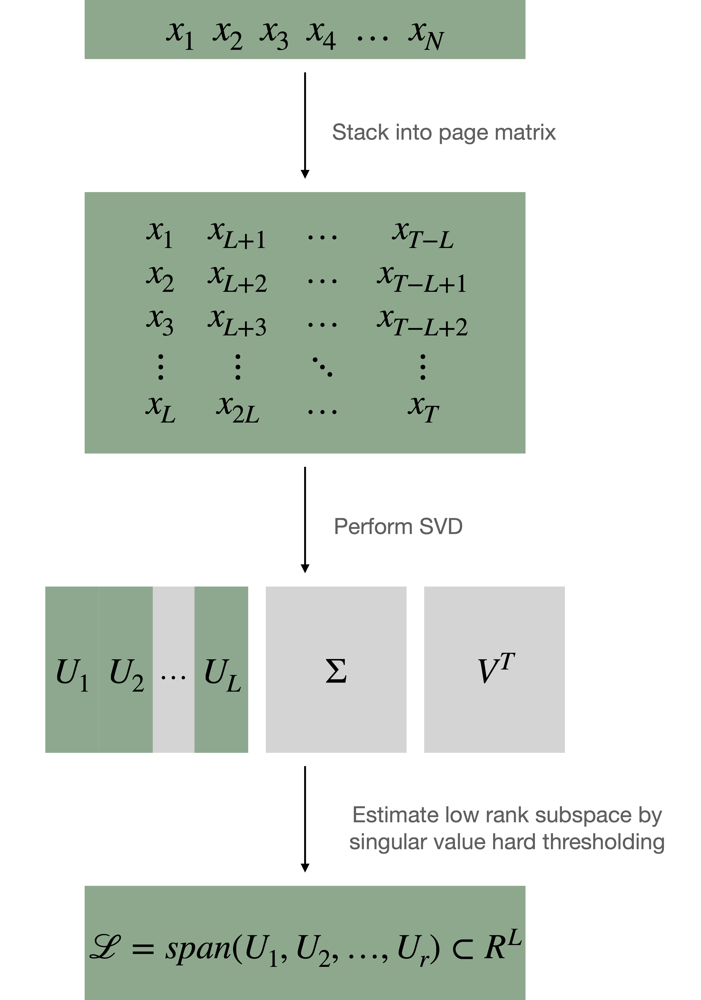

 
In this project, we propose an algorithm for change point detection in time series data and perform theoretical and empirical analysis of its performance. This algorithm utilizes a key data representation of time series: the stacked Page matrix, which has a low rank structure under our assumed model of the time series, which covers a large class of time series dynamics. This algorithm estimates a low rank subspace at which the time series is constrained (check figure below). It then performs hypothesis testing using CUSUM statistic and the distance between  vectors new data points and the time series subspace as a detection score. 

 
The performance of such an online detection algorithm is best measured using the Average Running Length (ARL): the expected number of steps until the algorithm detects a change point. We perform theoretical and empirical analyses of the ARL of our algorithm in cases of true positive detection and false detections. 

