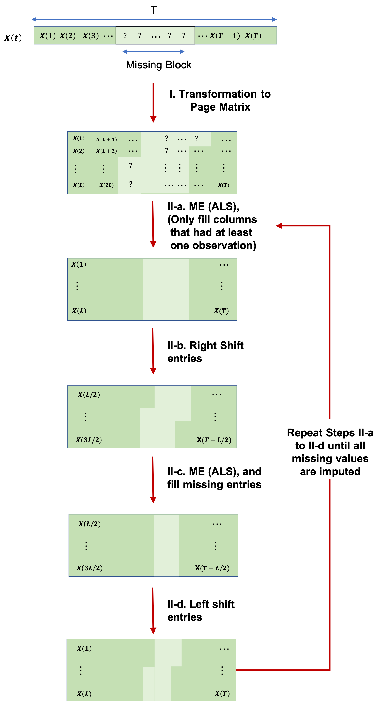

 
The problem of noisy and missing data is almost inevitable in any dataset. Accurate imputation algorithms are essential to recover missing values before further analysis is performed as most algorithms are promised complete data. This project focuses on imputing univariate time series data that suffer form missing vales in the form long blocks of consecutive missing entries. 

 
A recent approach towards time series imputation utilizes matrix completion algorithms to recover missing values. This approach converts the time series into a matrix then apply well-established matrix completion algorithms. In this project we proposed an extension to this approach to increase the imputation accuracy in the presence of diverse blocks of consecutive missing values (check the figure below). 

