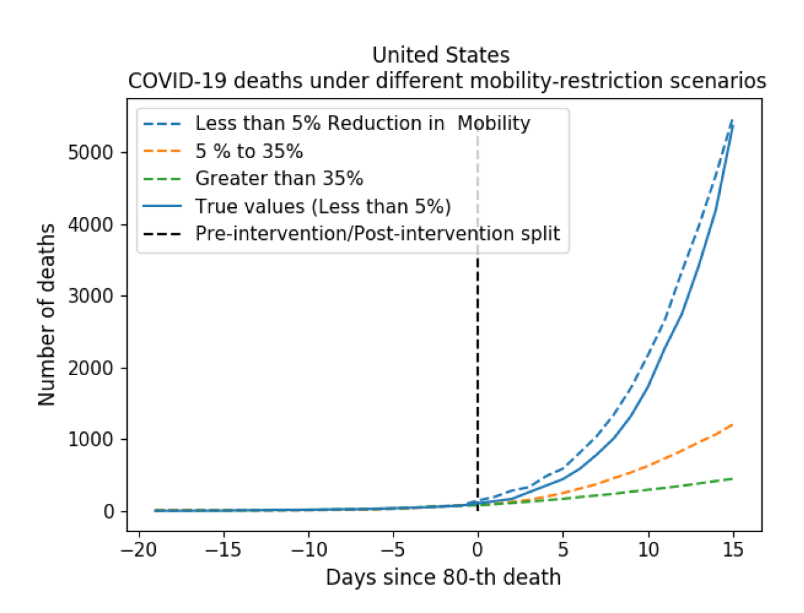

 
In this project, we develop a method to help quantify the impact different levels of mobility restrictions could have had on COVID-19 related deaths across nations. 

 
In the last few years, synthetic control (SC) has emerged as a standard tool in such scenarios to produce counterfactual estimates if a particular intervention had not occurred, using just observational data. However, it remains an important open problem of how to extend SC to obtain counterfactual estimates if a particular intervention had occurred - this is exactly the question of the impact of mobility restrictions stated above. 

 
In this project, we introduce synthetic interventions (SI), which helps resolve this open problem by allowing one to produce counterfactual estimates if there are multiple interventions of interest. We prove SI produces consistent counterfactual estimates under a tensor factor model. Our finite sample analysis shows the test error decays as 1/T0, where T0 is the amount of observed pre-intervention data. As a special case, this improves upon the bound on test error for SC in prior works. Our test error bound holds under a certain "subspace inclusion" condition; we furnish a data-driven hypothesis test with provable guarantees to check for this condition. This also provides a quantitative hypothesis test for when to use SC, currently absent in the literature.  In addition to the COVID-19 case study, we show how SI can be used to run data-efficient, personalized randomized control trials using real data from a large e-commerce website and a large developmental economics study.

## Resources:
- Synthetic Interventions [paper](/publication/SI).
- A data-driven response to a pandemic, [an MIT news article](https://news.mit.edu/2020/data-driven-response-pandemic-0515).